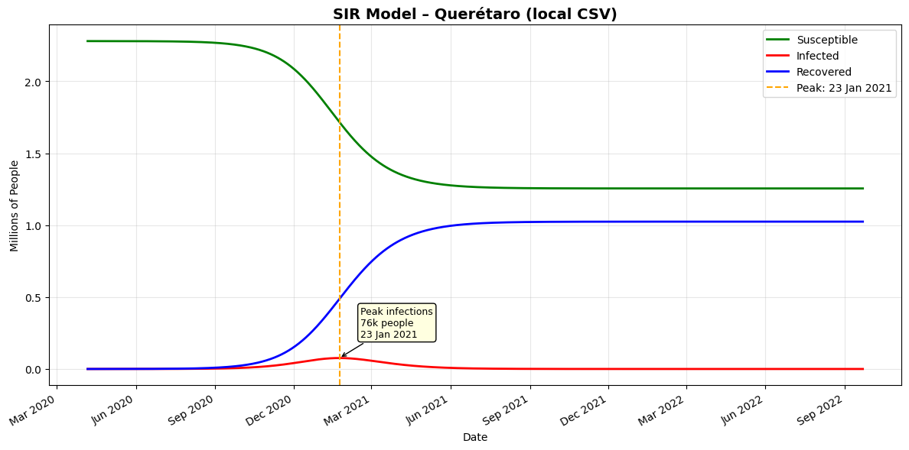

# Forecasting the COVID-19 Pandemic Evolution in Querétaro through the Kermack-McKendrick Model
This repository contains the Python implementation and raw data used to model and predict the evolution of the COVID-19 pandemic in Querétaro, México, from 2020 to 2021.
---
*March 9th, 2026 (A reinterpreted version of a project originally developed on November 25th, 2020)*

## Table of Contents

1. [Project Overview](#project-overview)
2. [SIR Model](#sir-model-kermack--mckendrick)
3. [Numerical Implementation](#numerical-implementation-runge-kutta-methods)
4. [Installation & Usage](#installation--usage)
5. [Results](#results)
6. [References](#references)

---

## Project Overview

Originally conducted under the guidance of [Dr. Ulises Velasco](https://orcid.org/0000-0002-2630-9095) and in collaboration with [Ing. Oscar Mena](linkedin.com/in/mena-oscar), this research project projects the pandemic's evolution using historical data.

The dataset was curated from the [public archive](https://gobqro.tumblr.com/archive/2020/10) of the Government of the State of Querétaro, covering 6 months and 22 days (April 4, 2020 - October 27, 2020). Specific data cleaning and formatting details are available in the `/data` directory.

---

## SIR Model (Kermack & McKendrick)

The Kermack & McKendrick model, also known as the SIR model, is a mathematical model used to describe the spread of infectious diseases through the flow of individuals between three mutually exclusive compartments: **Susceptibles** (S), **Infected** (I) and **Recovered** (R). 
### Postulates of the Model
- **Closed Population:** The total population ($N$) is constant; births and natural deaths are neglected. It must follow the equation:
$$N=S(t)+I(t)+R(t)\quad;\qquad\forall t$$
- **Irreversible Recovery:** Once an individual contracts the disease, they either gain immunity or die, entering the "Recovered" group.
- **Negligible Latency:** The period between exposure and becoming infectious is considered small enough to be ignored.

The system is governed by the following coupled ordinary differential equations (ODEs) with initial conditions for the population of each group at some time $t_0$

$$\begin{array}{ll}
	\frac{dS}{dt}=-\beta SI, & S(0)=S_0\\
	\frac{dI}{dt}=\beta SI-\gamma I, & I(0)=I_0\\
	\frac{dR}{dt}=\gamma I, & R(0)=R_0
\end{array}$$

where $\beta$ is the interaction rate between susceptibles and infected, and $\gamma$ is the gain rate of recovered individuals. Also $S_0$, $I_0$ y $R_0$ are the initial conditions, all positive.

---

## Numerical Implementation: Runge-Kutta Methods

To solve the system of ODEs, this project implements the 4th-order Runge-Kutta (RK4) method. This provides a high degree of numerical stability and precision compared to simpler methods like Euler's.

The Runge-Kutta methods are iterative methods, which take a value of the solution (initial condition of the differential equation) to compute the next value, which is used to compute the next one. A Runge-Kutta method of order $s$ has the following shape:

$$y_{n+1}=y_n+h\sum_{i=1}^sb_ik_i\quad;\quad k_i=f\left(x_n+hc_i,y_n+h\sum_{j=1}^sa_{ij}k_j\right)$$

Where $h$ is the space between $x_n$ and $x_{n+1}$.

The first Runge-Kutta methods are the following:
1. Of first order, also known as Euler's method, has the next equation:

$$y_{n+1}=y_n+hf(x_n,y_n)$$

2. Of second order, also known as the improved Euler's method or Heun's method, has the following equation:

$$y_{n+1}=y_n+\frac{h}{2}(k_1+k_2)\qquad ; \qquad \left.
\begin{array}{l}
	k_1=f(x_n,y_n)\\
	k_2=f(x_n+h,y_n+hk_1)
\end{array}
\right.$$

3. Of fourth order, the standard Runge-Kutta, has the following equation:

$$y_{n+1}=y_n+\frac{h}{6}(k_1+2k_2+2k_3+k_4)\qquad ; \qquad \left.
\begin{array}{l}
	k_1=f(x_n,y_n)\\
	k_2=f(x_n+\frac{1}{2}h,y_n+\frac{1}{2}hk_1)\\
  k_3=f(x_n+\frac{1}{2}h,y_n+\frac{1}{2}hk_2)\\
  k_4=f(x_n+h,y_n+hk_3)
\end{array}
\right.$$

As the order of the Runge-Kutta method increases, the precision of the obtained approximation will increase accordingly. This implementation allows for adjusting the time step ($h$) to observe the convergence of the pandemic curves.

---

## Installation & Usage
### Python Version
- Python 3.7 or higher recommended
- Check your version: `python --version` or `python3 --version`

### Required Libraries
Most libraries are built-in, but you'll need to install:
- Libraries: `numpy`, `matplotlib`, `pandas`
#### Setup
1. Clone repository:
```bash
git clone https://github.com/b-salgado13/sir-covid-model.git
cd covid-queretaro-sir
```
2. Install dependencies:
```bash
pip install -r requirements.txt
```

### Running the Model
To execute the main simulation and generate plots for the Querétaro data **Run from terminal**:
   ```bash
   python SIR_RK4_Covid-19.py
   ```
   or
   ```bash
   python3 SIR_RK4_Covid-19.py
   ```

---

## Results

The model outputs a visualization of the pandemic peak and the stabilization of the recovered population.


And also shows the following data
```bash
Peak    : 23 Jan 2021 (76,058 infected)
Total infected by end: 44.94% of population
```

Which, according to some [local news](https://oem.com.mx/diariodequeretaro/local/pico-de-contagios-dos-mil-88-nuevos-casos-de-covid-19-este-fin-de-semana-en-queretaro-17917288) show that the date of the peak was just 7 days off and had an error of 30.45% in the amount of infected people in that peak (the real value was around 109,371).

Also, it shows that almost 45% of the total population would get infected by the end of the pandemic.

## Limitations and Technical Notes

While this dataset provides a robust basis for compartmental modeling, the following limitations should be considered:

- **Reporting Latency:** Daily fluctuations in `Increased_Cases` often reflect administrative reporting cycles rather than actual biological spread.
- **Testing Gap:** Asymptomatic cases are likely underrepresented, leading to a potential overestimation of the Susceptible ($S$) population.
- **Discrete Approximation:** The use of finite differences to estimate $\beta$ and $\gamma$ assumes $dt=1$ day. High volatility in daily reports may result in outliers for these parameters.
- **Simplified Dynamics:** The model does not account for the "Exposed" (E) period (SEIR model), which may result in a temporal shift between the predicted and observed peaks.

---
## References

1. Hou, Y., & Bidkhori, H. (2024). Multi-feature SEIR model for epidemic analysis and vaccine prioritization. From [link](https://pmc.ncbi.nlm.nih.gov/articles/PMC10906911/)
2. Pliego Pliego, E. (2011). Modelos Epidemiológicos de Enfermedades Virales Infecciosas. Benemérita Universida Autónoma de Puebla. From [link](https://www.fcfm.buap.mx/assets/docs/docencia/tesis/matematicas/EmileneCarmelitaPliegoPliego.pdf)
3. Velasco Hernández, J. (2020). Modelos matemáticos en epidemiología: enfoques y alcances \[Ebook\] (1st ed., pp. 3-8). Instituto Mexicano del Petróleo. From [link](https://miscelaneamatematica.org/download/tbl_articulos.pdf2.bda3ee3a3db0aee2.56656c617a636f5f6a2e706466.pdf)
4. Montesinos López, O., & Hernández Suárez, C. (2007). Modelos matemáticos para enfermedades infecciosas. Scielosp.org. From [link](https://www.scielosp.org/pdf/spm/2007.v49n3/218-226)

5. Zill, D. (2020). Ecuaciones Diferenciales con aplicaciones de modelado [Ebook] (9th ed., pp. 361-363). Cengage Learning. From [link](https://cutbertblog.files.wordpress.com/2019/01/zill-d.g.-ecuaciones-diferenciales-con-aplicaciones-de-modelado-cengage-learning-2009.pdf)
6. Metodos de Runge-Kutta - Solucion numerica de ecuaciones diferenciales - Mathstools. Mathstools. (2020). From [link](https://www.mathstools.com/section/main/Metodos_de_Runge_Kutta?lang=es#.X72hkp1Kjec)
7. Métodos Numéricos en Ecuaciones Diferenciales Ordinarias. Campus.usal.es. (2020). From [link](http://campus.usal.es/~mpg/Personales/PersonalMAGL/Docencia/MetNumTema4Teo(09-10).pdf)


